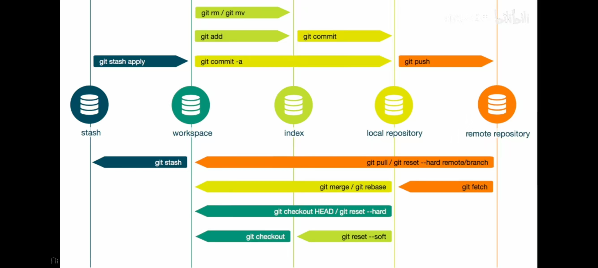
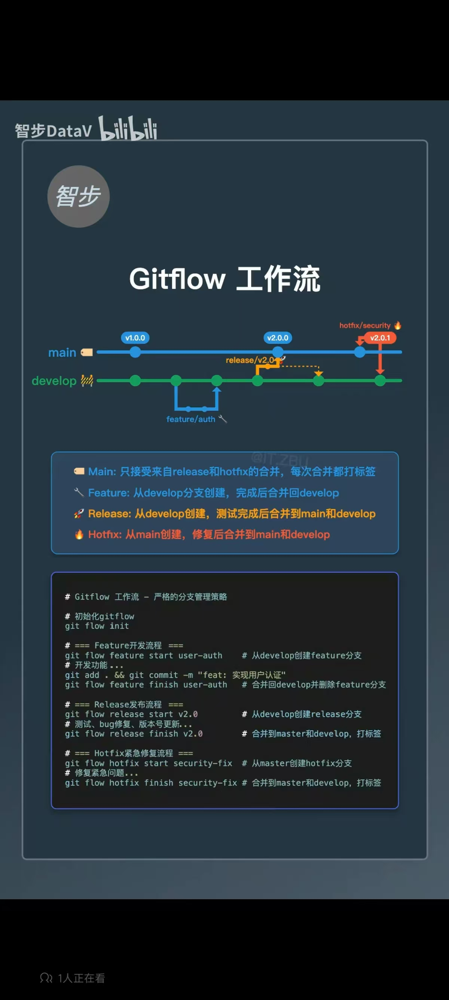

# Git相关

## 5大区



- 工作区 (workspace) 中的文件一般是未追踪状态，即`Untracked/Unstage`
- 暂存区 (index) 中的文件一般是，已经追踪状态`Stage`
- 本地仓库 (local repository)
- 远端仓库 (remote repository)
- 贮藏区 (stash)，可将工作区域中的变更，贮藏起来，必要时候再取出来用。

## 常规设置

```bash
git config --global user.name "Ricardo_MI" # 如果用户名中没有空格，可以不使用双引号
git config --global user.email "ricardoryn1317@gmail.com"

git config --global init.defaultBranch main # 设置默认分支名字为main
git config --global credential.helper store # 为了防止git push的时候老师需要用户名和密码，可以加上这个设置

# 可选
git config --global http.sslverify false # 防止git clone出现server certificate verification failed. CAfile: none CRLfile: none的问题

# 查看config文件
cat ~/.gitconfig
```

## SSH免密登录

```bash
ssh-keygen -t rsa -b 4096 -C ricardoryn1317@gmail.com # -t表示对应的加密算法，-b表示生成密钥的长度为4096，-C则是为添加的公钥增加注释
```

敲完回车，终端会显示：

```
Generating public/private rsa key pair.
Enter file in which to save the key (/c/Users/Layne/.ssh/id_rsa):
```

可以自己指定文件保存地点 (但建议默认位置)：

```
/c/Users/RicardoRyn/.ssh/git_ssh_key
```

后面回车，终端问你需不需要输入密码，不需要就继续回车，最后终端显示 (这里建议不设密码，没必要)：

```
Your identification has been saved in /c/Users/RicardoRyn/.ssh/git_ssh_key
Your public key has been saved in /c/Users/RicardoRyn/.ssh/git_ssh_key.pub.
```

复制`git_ssh_key.pup`里的内容，登录GitHub，在`Setting`里`SSH and GPG keys`中新增SSH key, title命名为`ricardo_github`，然后把复制内容粘贴保存。

```bash
ssh -T git@github.com # 测试ssh连接是否成功
```

---

**补充知识：**

关于 ssh 免密登录服务器

```bash
ssh-keygen -t rsa -b 4096 -C ricardoryn1317@gmail.com # -t表示对应的加密算法，-b表示生成密钥的长度为4096，-C则是为添加的公钥增加注释
ssh-copy-id aaa@xxx.xxx.xxx.xxx                       # 将本地的ssh公钥复制到远程机器的`~/.ssh/authorized_keys`文件中，这样就可以通过ssh密钥认证的方式，免去输入密码
```

要求用git@github.com形式，可以用如下形式转换

```bash
git remote set-url origin git@github.com:RicardoRyn/Plot_fig.git
```

---

## 操作

### 常用命令

```bash
git status

git add .                # 将文件从工作区添加到暂存区
git restore --staged 文件名 # 将文件从暂存区恢复到工作区

git commit # 进入vim，写较长的修改日志
git commit -m "提交信息"
git commit -a -m "提交信息" # -a即--amend，更改上一次提交的修改日志

git switch 分支名      # 切换本地分支
git checkout -b 分支名 # 创建并切换到新的分支
git checkout 远端分支名  # 在本地检出远端分支

git branch                   # 列出本地所有的branch
git branch -a                # 列出所有的branch，包括远程分支
git branch -d 分支名            # 删除指定分支，如果该分支未合并，可以使用-D强行删除
git push origin --delete 分支名 # 删除远程分支

# 不再追踪某个文件
git rm --cached 文件名
```

本地推送到远端

```bash
git remote add origin https://github.com/RicardoRyn/Plot_fig.git
git remote -v

git push # 输入用户名，token
git push -u origin main
git push --tags # 将所有tag push上去

## 远端拉取到本地
# 假设远程仓库已经被修改，与本地不同
git fetch # 本地文件暂时不会发生变化，只是拉到了本地仓库（不是工作区）

# 确认没有问题，再将远程仓库pull到工作区
git pull # 一定建议先git fetch，再git diff查看有没有冲突，再git pull
# 如果pull之前本地和远端的commit不一样，会自动使用 merge 并生成合并commit
git pull --rebase # 不会生成合并commit
```

信息

```bash
# 2点比较
git log 分支1..分支2  # 查看分支2上有但是分支1上没有的改动
git diff 分支1..分支2 # 查看分支2上有但是分支1上没有的改动
git diff origin/main
# 3点比较 (Github默认的比较是3点比较)
git diff 分支1...分支2 # 查看分支2上有，但是分支1和分支2的共同祖先没有的改动

git diff          # 比较工作区和暂存区
git diff --staged # 比较暂存区和本地分支
git diff HEAD     # 比较工作区和本地分支的差异
```

### 暂存

```bash
git stash    # 必须先`git add`进暂存区
git stash -a # 暂存所有文件，包括工作区中的文件

git stash list

git stash apply 'stash@{0}' # 将暂存区取出来，但是不删除这个stash，powershell中花括号是特殊语法，需要用引号括起来
git stash drop 'stash@{0}'  # 手动删除指定stash
git stash pop               # 将暂存区取出来，同时删除这个stash
```

### 合并

`git merge feature`: 必须位于 main 分支，然后把feature的合并到 main 上来

`git merge --squash feature` # sqush merge之后，还要手动 commit

`git cherry-pick 提交1 提交2 ...`: 必须位于 main 分支上，然后把指定的 commits 合并到 main 上 (注意顺序)

`git rebase main`: 必须位于 feature 分支，然后把 feature 的变基到 main 上去

> 注意这2者的区别

`git merge origin/分支名`: 将远端的分支合并到当前分支

`git merge --no-ff feature`: 非快速前进合并，会产生 merge commit

### 后悔药

| Git操作 | Git命令                                   | 使用场景                                     | 注意事项               |
| ------- | ----------------------------------------- | -------------------------------------------- | ---------------------- |
| discard | `git restore 文件名`（单个文件）          | 工作区的修改还未commit                       | 舍弃掉工作区修改的文件 |
|         | `git restore --staged 文件名`（单个文件） | 把文件从暂存区拿出来                         | 舍弃掉工作区修改的文件 |
|         | `git restore --hard`（所有文件）          |                                              |                        |
| reset   | `git reset 提交`                          | 还原到某个commit的状态，舍弃之后的commits    |                        |
|         | `git reset --mixed 提交`                  | 还原到某个commit的状态，但是保留本地文件更改 |                        |
| revert  | `git revert 提交`                         | 使用一个新的commit抵消某次commit的修改       |                        |
| amend   | `git commit --amend`                      | 只能修改最新一次的commit                     |                        |

## 标签

```bash
git tag v1.0.0
git tag v1.0.1 提交
git push --tag

git tag -d v1.0.0               # 删除本地tag
git push origin --delete v1.0.0 # 删除远程tag
```

## 工作流

参考视频：[十分钟学会正确的github工作流，和开源作者们使用同一套流程-哔哩哔哩](https://b22.tv/vR4P09H)

`main`, `relsease`, `dev`, `feature`, `hotfix` 5大分支


